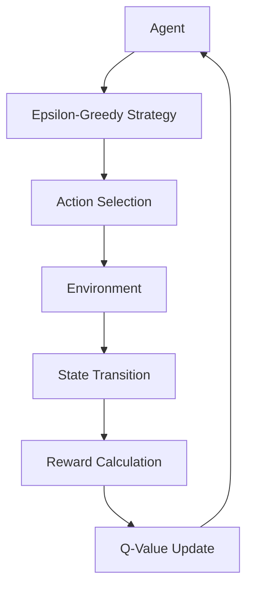

# 🤖 Numerical Tic-Tac-Toe: Q-Learning Agent
**Surgical Reinforcement Learning for Stochastic Game Environments**

[](https://github.com/google/gemini-cli)
[](https://www.python.org/)
[](https://numpy.org/)
[](https://opensource.org/licenses/MIT)

**Numerical Tic-Tac-Toe** is a reinforcement learning project that implements a **Q-Learning** agent capable of winning a variant of Tic-Tac-Toe using numbers 1-9. The agent learns to optimize its strategy against a stochastic environment through episodic exploration and exploitation.

`✅ RL Agent Training | ✅ Stochastic Environment | ✅ MIT Licensed | ✅ Jupyter Notebook Hub`

## 🏗 Architecture
The system is built with a decoupled Environment-Agent architecture, following the standard RL Markov Decision Process (MDP) framework.



### Core Components
- **Environment (`TCGame_Env.py`)**: Implements the game logic, including `is_winning`, `is_terminal`, and stochastic opponent moves.
- **Agent Hub (`TicTacToe_Agent.ipynb`)**: Contains the Q-learning algorithm, hyperparameter tuning, and convergence tracking logic.
- **State Manager**: Handles the conversion of 3x3 grid states into hashable formats for the Q-table.
- **Convergence Engine**: Tracks state-action pairs over thousands of episodes to ensure policy stability.

## 🚀 Getting Started

1. **Install Dependencies**:
   ```bash
   pip install numpy jupyter
   ```

2. **Run the Agent**:
   Open `TicTacToe_Agent.ipynb` in Jupyter Notebook and execute the cells to start training.

3. **Verify Convergence**:
   Check the plots at the end of the notebook to visualize the Q-value stabilization.

## 📜 License
This project is licensed under the **MIT License** - see the [LICENSE](LICENSE) file for details.

---
*Built with ❤️ for Intelligent Game Design.*
